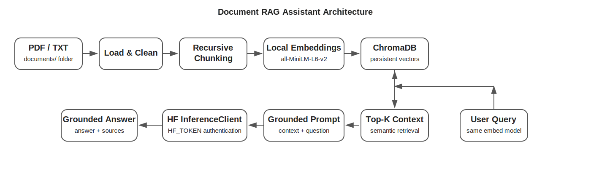
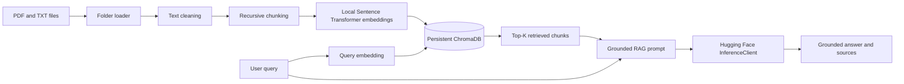

# Document RAG Assistant

A framework-free Retrieval-Augmented Generation project built with raw Python, local Sentence Transformer embeddings, ChromaDB, and Hugging Face hosted LLM inference.

> No LangChain. No LlamaIndex. The purpose is to make every RAG stage explicit and interview-explainable.

## Architecture





## What changed from the lecture notebook?

The lecture version used inline fallback content and notebook-global variables. This repository version:

- reads every `.pdf` and `.txt` file from `documents/`
- recursively supports subfolders
- fails clearly when no documents exist instead of injecting hardcoded text
- loads secrets from `.env`
- actually passes `HF_TOKEN` to `InferenceClient`
- uses local embeddings and persistent ChromaDB
- separates loading, processing, embeddings, storage, and LLM logic
- provides a CLI entry point and interview guide

## Project structure

```text
document-rag-assistant/
├── assets/
│   └── architecture.svg
├── documents/
│   └── README.md
├── notebooks/
│   └── Document_RAG_Assistant_HuggingFace.ipynb
├── src/
│   ├── __init__.py
│   ├── config.py
│   ├── document_loader.py
│   ├── embeddings.py
│   ├── llm.py
│   ├── rag_pipeline.py
│   ├── text_processing.py
│   └── vector_store.py
├── .env.example
├── .gitignore
├── INTERVIEW_GUIDE.md
├── LICENSE
├── README.md
├── main.py
└── requirements.txt
```

## Setup

### 1. Clone the repository

```bash
git clone <your-repository-url>
cd document-rag-assistant
```

### 2. Create a virtual environment

```bash
python -m venv .venv
```

Windows:

```bash
.venv\Scripts\activate
```

Linux/macOS:

```bash
source .venv/bin/activate
```

### 3. Install dependencies

```bash
pip install -r requirements.txt
```

### 4. Configure the Hugging Face token

Copy `.env.example` to `.env`.

Windows:

```bash
copy .env.example .env
```

Linux/macOS:

```bash
cp .env.example .env
```

Edit `.env`:

```env
HF_TOKEN=hf_your_real_token_here
```

Never commit `.env`.

### 5. Add your own documents

Copy PDF and TXT files into:

```text
documents/
```

Example:

```text
documents/
├── medical_imaging_notes.pdf
├── rag_research.pdf
└── company_policy.txt
```

There is no hardcoded knowledge document. The application indexes your files.

### 6. Run

```bash
python main.py
```

Ask a question and inspect the answer, sources, retrieval distances, and retrieved evidence.

## Hugging Face token flow

```text
.env
  ↓
src/config.py
  ↓ HF_TOKEN
src/llm.py:create_hf_client()
  ↓ api_key=hf_token
InferenceClient
  ↓
chat_completion()
```

The Sentence Transformer embedding model runs locally. The Hugging Face token is used for hosted LLM inference.

## RAG flow

1. Load PDF pages and TXT files from `documents/`.
2. Preserve source and page metadata.
3. Clean extracted text.
4. Create sentence-aware chunks.
5. Generate normalized local embeddings.
6. Store chunks and vectors in persistent ChromaDB.
7. Embed the user query with the same model.
8. Retrieve top-K semantic matches.
9. Build a context-only RAG prompt.
10. Send the prompt through authenticated Hugging Face inference.
11. Return the answer, source names, and retrieved evidence.

## Key design decisions

| Decision | Choice |
|---|---|
| RAG frameworks | None |
| Embeddings | `all-MiniLM-L6-v2` |
| Embedding execution | Local |
| Vector store | Persistent ChromaDB |
| LLM access | Hugging Face `InferenceClient` |
| Documents | Folder-based PDF/TXT loading |
| Chunk size | 500 characters |
| Retrieval K | 3 |
| Temperature | 0.2 |

## Limitations

This version does not perform OCR for scanned PDFs, hybrid retrieval, reranking, incremental indexing, or automated RAG evaluation. These are logical next improvements for a production version.

## Interview preparation

See `INTERVIEW_GUIDE.md` for the 30-second explanation, design decisions, hallucination-control strategy, limitations, and production improvements.

## License

MIT
